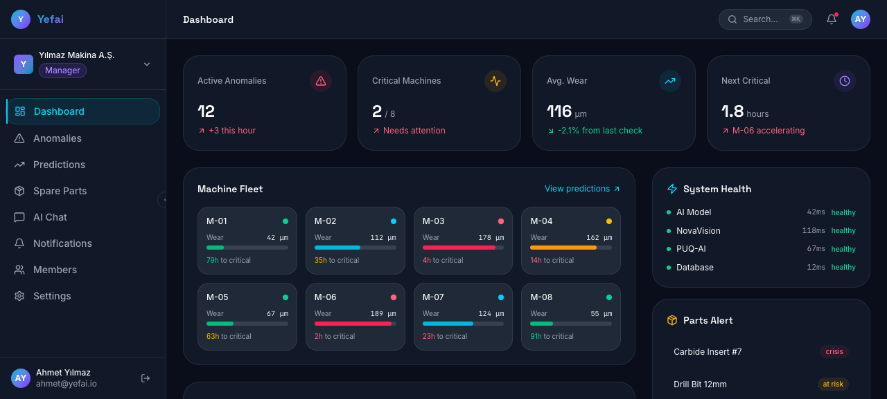
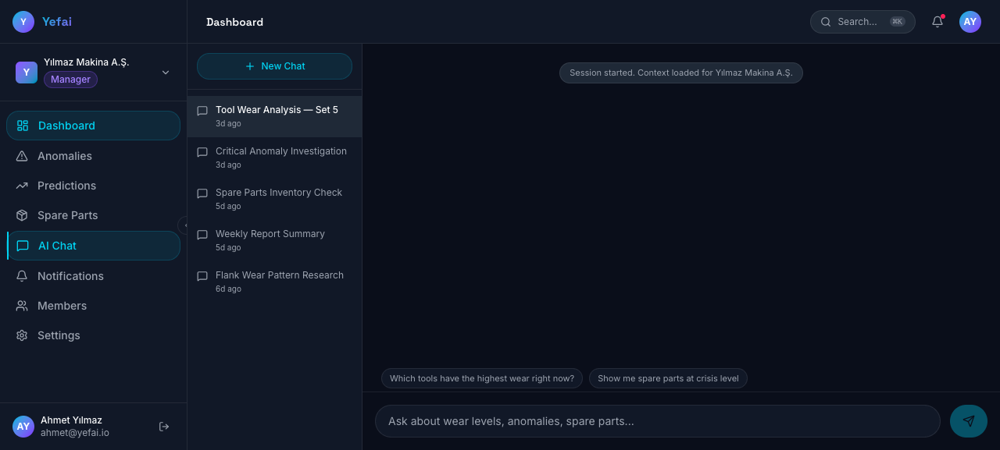
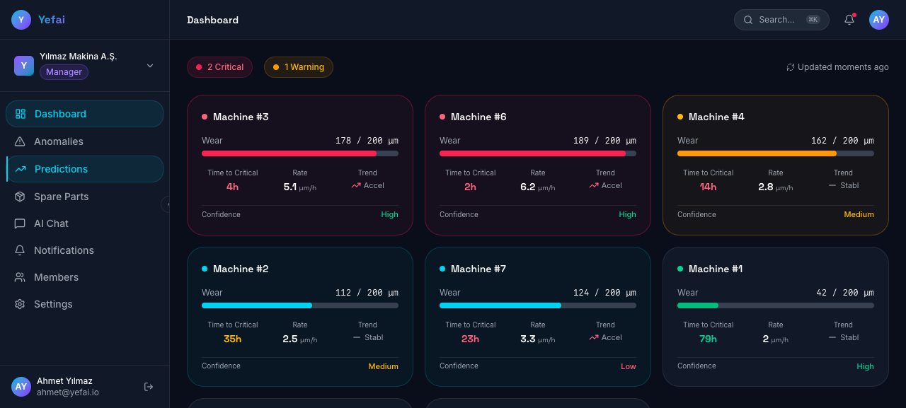

# Yefai — Endüstriyel Kestirimci Bakım Platformu

Yefai, **Industry 4.0** için geliştirilmiş, görüntü ve sensör verilerini kullanarak takım aşınmasını gerçek zamanlı tespit eden, ne zaman değiştirilmesi gerektiğini öngören ve yedek parça tedarik sürecini otomatikleştiren **B2B SaaS** kestirimci bakım (predictive maintenance) platformudur.

> **Canlı Demo:** [yefai.vercel.app](https://yefai.vercel.app)

---

## Ekran Görüntüleri

| Dashboard | Chat (RAG) | Tahminler |
|:---:|:---:|:---:|
|  |  |  |

---

## Özellikler

- **Anomali Tespiti:** PatchCore modeli ile görüntü tabanlı anomali tespiti ve aşınma sınıflandırması
- **Aşınma Tahmini:** Geçmiş anomali skorlarından lineer regresyon ile µm bazında aşınma oranı ve kritik seviyeye kalan süre projeksiyonu
- **RAG Chatbot:** Jina CLIP v2 embedding + pgvector benzerlik araması + LangChain GPT analizi ile bağlam destekli sohbet
- **PUQ AI Bildirim:** Telegram, E-posta ve SMS kanallarından otomatik anomali bildirimi
- **Yedek Parça Krizi:** Otomatik kriz skoru hesaplama, alternatif tedarikçi önerme, otomatik satın alma siparişi
- **Çoklu Organizasyon:** B2B SaaS altyapısı — organizasyon, üye ve rol yönetimi
- **Karanlık Mod:** next-themes ile tam karanlık mod desteği

---

## Mimari

Yefai, görüntü anomali tespitinden e-posta bildirimine kadar uçtan uca bir AI boru hattı çalıştırır:

```
Görüntü → NovaVision (PatchCore) → Anomali Skoru
                ↓
       Jina CLIP v2 Embedding
                ↓
    Supabase pgvector Benzerlik Araması (Top-5)
                ↓
       LangChain + GPT-4o Analizi
                ↓
         PUQ AI Webhook
                ↓
   Telegram / E-posta / SMS Bildirimi
```

Ayrıntılı boru hattı dokümantasyonu: [`server/docs/nova-rag-langchain-puq-pipeline.md`](server/docs/nova-rag-langchain-puq-pipeline.md)

---

## Teknoloji Yığını

### Frontend
| Teknoloji | Açıklama |
|-----------|----------|
| Next.js 16 | React framework (App Router) |
| React 19 | UI kütüphanesi |
| TypeScript | Tip güvenliği |
| Tailwind CSS 4 | Utility-first CSS |
| Three.js / R3F | 3D landing sahnesi |
| Framer Motion | Animasyon |
| Recharts | Grafikler |
| Zustand | State yönetimi |
| next-themes | Karanlık/aydınlık tema |

### Backend
| Teknoloji | Açıklama |
|-----------|----------|
| FastAPI | Python async web framework |
| Supabase | Veritabanı + Auth + pgvector |
| PyTorch / Anomalib | PatchCore anomali tespiti |
| Jina CLIP v2 | Görüntü embedding (1024-dim) |
| LangChain | GPT analiz zinciri |
| PUQ AI | Bildirim otomasyon webhook'ları |

---

## Proje Yapısı

```
yefai/
├── client/                # Next.js 16 frontend
│   └── src/
│       ├── app/           # Sayfalar (landing, login, dashboard/*)
│       ├── components/    # UI bileşenleri
│       ├── services/      # Mock veri servisleri
│       └── store/         # Zustand state yönetimi
├── server/                # FastAPI backend
│   ├── ai/                # AI modülleri
│   │   ├── anomalib/      # PatchCore eğitim/inference
│   │   ├── embeddings/    # Jina CLIP v2 embedding
│   │   ├── novavision/    # NovaVision Docker inference
│   │   ├── prediction/    # Aşınma tahmin motoru
│   │   ├── langchain/     # RAG ajanı
│   │   └── puqai/         # PUQ AI webhook istemcisi
│   ├── routers/           # 15 API router
│   ├── services/          # İş mantığı servisleri
│   ├── db/                # Supabase + 12 migration
│   └── docs/              # Backend dokümantasyonu
├── data/                  # Embedding, manifest dosyaları
├── docs/                  # Mimari dokümanları
├── notebooks/             # Jupyter EDA notebook'ları
├── screenshots/           # Ekran görüntüleri
└── tests/                 # Backend testleri
```

---

## Başlangıç

### Gereksinimler

- Node.js 20+
- Python 3.12+
- Supabase hesabı (pgvector eklentili)
- Docker (NovaVision için opsiyonel)

### Kurulum

```bash
# Repoyu klonla
git clone https://github.com/anomalyco/yefai.git
cd yefai

# Backend bağımlılıklarını yükle
cd server
pip install -r requirements.txt

# Supabase bağlantısı için .env oluştur
cp .env.example .env
# SUPABASE_URL ve SUPABASE_ANON_KEY değerlerini doldur

# Migration'ları çalıştır
# (Supabase Dashboard → SQL Editor → db/migrations/ sırayla)

# Frontend bağımlılıklarını yükle
cd ../client
npm install

# .env.local oluştur
cp .env.example .env.local
# NEXT_PUBLIC_API_URL=http://localhost:8001
```

### Geliştirme

```bash
# Root dizinden hem frontend hem backend'i başlat
npm run dev

# Veya ayrı ayrı:
cd server && uvicorn main:app --reload --port 8001
cd client && npm run dev
```

- Frontend: http://localhost:3000
- Backend API: http://localhost:8001
- Swagger Docs: http://localhost:8001/docs

### Test

```bash
# Backend testleri
cd server && python -m pytest ../tests/ -v

# Frontend testleri
cd client && npm test
```

---

## Faz Durumu

| Faz | Açıklama | Durum |
|-----|----------|-------|
| Phase 1 | Veri Altyapısı & Supabase | Tamamlandı |
| Phase 2A | Anomalib + Embedding | Tamamlandı |
| Phase 2B | NovaVision Local Inference | Mock-mode hazır |
| Phase 2.5 | Aşınma Tahmin Motoru | Tamamlandı |
| Phase 3A | RAG Pipeline | Devam ediyor |
| Phase 3B | PUQ AI Bildirim + Kriz | Mock-mode hazır |
| Phase 4 | FastAPI Entegrasyonu | Başlamadı |

---

## Demo Hesapları

| Rol | E-posta | Şifre |
|-----|---------|-------|
| Yönetici | admin@yefai.io | yefai2024 |
| Teknisyen | tech@yefai.io | yefai2024 |
| Satın Alma | procurement@yefai.io | yefai2024 |
| Operatör | operator@yefai.io | yefai2024 |

---

## Lisans

MIT
