# NovaVision → RAG → LangChain GPT → PUQ AI Boru Hattı

> **Amaç:** Mevcut Yefai planına ek olarak, NovaVision çıktısını alıp Vector DB
> üzerinden benzer görsellerle zenginleştirip, LangChain GPT ile analiz edip, 
> PUQ AI üzerinden e-posta bildirimi gönderen uçtan uca bir anomali analiz boru hattı.
>
> **Durum:** Plan aşaması — mevcut `.planning/` içindeki Phase 2B/3A/3B'ye
> entegre edilecek ek bir akış.
>
> **Son güncelleme:** 2026-05-16

---

## 1. Mevcut Plan ile İlişkisi

Bu doküman, mevcut 7 fazlı Yefai planına **yeni bir akış** eklemektedir.
Mevcut planın özeti:

| Faz | İçerik | Durum |
|-----|--------|-------|
| Phase 1 | Veri Altyapısı & Supabase | ✅ Tamamlandı |
| Phase 2A | Anomalib + Embedding (Jina CLIP v2) | ✅ Kod yazıldı |
| Phase 2B | NovaVision Local Inference | ⚠️ Mock-mode hazır |
| Phase 2.5 | Gelecek Tahmini | ❌ Başlamadı |
| Phase 3A | RAG Pipeline (sohbet chatbot'u) | ❌ Başlamadı |
| Phase 3B | PUQ AI Bildirim | ❌ Başlamadı |
| Phase 4 | FastAPI Entegrasyon | ❌ Başlamadı |

**Bu dokümanda anlatılan akış şunları değiştiriyor:**

- Phase 2B NovaVision çıktısı → direkt PUQ'a gitmek yerine, önce Vector DB
  aramasından geçiyor
- Phase 3A RAG Pipeline'ı sadece sohbet chatbot'u değil, **anomali analiz
  bağlamı** için de kullanılıyor
- Supabase içinde RAG işlemi için **yeni bir Edge Function** yazılıyor
- LLM tarafına **LangChain** ekleniyor (mevcut planda direkt Gemini/Claude API)
- PUQ AI çıktısı e-posta olarak gönderiliyor

---

## 2. Sistem Mimarisi (Mermaid Diagram)

```mermaid
flowchart TB
    subgraph GIRIS["1. GİRİŞ — NovaVision Anomali Tespiti"]
        NV_IN["📸 Görüntü Gönder"]
        NV_MODEL["🧠 NovaVision Local\nDocker Container\n(PatchCore .pt model)"]
        NV_OUT["📊 Anomali Skoru\n(örn: 0.87 / 90)"]
    end

    subgraph VECTOR["2. VEKTÖR ARAMA — pgvector Benzerlik"]
        EMBED["🔢 Jina CLIP v2\nGörüntü Embedding'i\n(1024-dim vektör)"]
        VDB[("🗄️ Supabase pgvector\nTüm görüntü embedding'leri\n+ image_id + metadata")]
        SEARCH["🔍 Cosine Similarity Search\nTop-K = 5 en benzer görüntü"]
        SUPABASE_FN["⚡ Supabase Edge Function\n`search_similar_images`\nREST API endpoint"]
        RESULTS["🖼️ 5 Benzer Görüntü\n(scaled, ~256x256)\n+ metadata + feature'lar"]
    end

    subgraph LANGCHAIN["3. LANGCHAIN GPT ANALİZİ"]
        LC_IN["📦 Context Assembly\n• Anomali skoru\n• 5 benzer görüntü (base64)\n• Feature'lar (aşınma tipi, seviye)\n• Metadata (set, zaman)"]
        LC_PROMPT["📝 System Prompt\n'Endüstriyel anomali tespit\nuzmanısın. Bağlam kurmadan,\nsadece veriye dayalı analiz yap.'"]
        LC_MODEL["🤖 LangChain + GPT\n(OpenAI / Gemini Flash)\nContext + Prompt → Analiz"]
        LC_OUT["📋 Yapılandırılmış Analiz\n• Anomali doğrulama\n• Benzer vakalarla karşılaştırma\n• Aşınma trendi yorumu\n• Önerilen aksiyon"]
    end

    subgraph PUQAI["4. PUQ AI BİLDİRİM"]
        WEBHOOK["📤 Webhook POST\n(puq.ai webhook URL)"]
        PUQ_WORKFLOW["⚙️ PUQ AI Workflow\n• Model Router\n• E-posta Şablonu\n• Alıcı Listesi"]
        EMAIL["📧 E-posta Bildirimi\n• Anomali detayı\n• Benzer vaka görselleri\n• LLM analizi\n• Aksiyon önerisi"]
    end

    GIRIS --> VECTOR
    VECTOR --> LANGCHAIN
    LANGCHAIN --> PUQAI

    NV_IN --> NV_MODEL --> NV_OUT
    NV_OUT --> EMBED
    EMBED --> VDB --> SEARCH --> SUPABASE_FN --> RESULTS
    RESULTS --> LC_IN
    LC_IN --> LC_PROMPT --> LC_MODEL --> LC_OUT
    LC_OUT --> WEBHOOK --> PUQ_WORKFLOW --> EMAIL

    style GIRIS fill:#1a1a2e,stroke:#e94560,color:#eee
    style VECTOR fill:#16213e,stroke:#0f3460,color:#eee
    style LANGCHAIN fill:#0f3460,stroke:#533483,color:#eee
    style PUQAI fill:#1a1a2e,stroke:#e94560,color:#eee
```



---

## 3. Bileşen Detayları

### 3.1 NovaVision Anomali Tespiti (Giriş Katmanı)

**Ne yapar:** Phase 2B'de kurulan NovaVision local Docker container, Phase 2A'da
eğitilen PatchCore modelini çalıştırarak gelen görüntü için anomali skoru üretir.

**Çıktı:**
```json
{
  "image_id": "matwi_set03_img_0042",
  "anomaly_score": 0.87,
  "anomaly_map": "base64_heatmap...",
  "wear_type": "flank_wear",
  "wear_value_um": 120.5,
  "timestamp": "2026-05-16T10:30:00Z"
}
```

**Kritik noktalar:**
- Skor 0-1 aralığında float değer (örn: 0.87). Kullanıcı isteğine göre 80-90 
  gibi 0-100 skalasında da ifade edilebilir.
- Anomali haritası (heatmap) — sonraki aşamalarda görselleştirme için kullanılır.
- `image_id` — Vector DB aramasında anahtar olarak kullanılır.

**Mevcut plandaki yeri:** Phase 2B, `server/ai/novavision/inference.py`

---

### 3.2 Vector DB Benzerlik Araması (RAG Katmanı)

**Ne yapar:** NovaVision'dan gelen görüntünün Jina CLIP v2 embedding'ini alır,
Supabase pgvector içinde tüm görüntüler arasında cosine similarity araması yapar,
en benzer 5 görüntüyü döndürür.

#### 3.2.1 Embedding Üretimi

- **Model:** Jina CLIP v2 (Phase 2A'da zaten yüklü)
- **Boyut:** 1024-dim vektör
- **Batch:** Tek görüntü için anlık embedding (MRL ile opsiyonel boyut kısaltma)

#### 3.2.2 Supabase pgvector Sorgu

```sql
SELECT 
    image_id, 
    file_path, 
    wear_type, 
    wear_value_um,
    set_id,
    anomaly_score,
    image_embedding <=> query_embedding AS similarity
FROM images
WHERE image_id != $query_image_id
ORDER BY image_embedding <=> query_embedding
LIMIT 5;
```

**`<=>` operatörü:** pgvector'de cosine distance. Küçük değer = daha benzer.

#### 3.2.3 Supabase Edge Function — `search_similar_images`

Supabase içinde çalışacak bir Edge Function (Deno/TypeScript veya Python). 
Bu function:

```typescript
// Supabase Edge Function: search_similar_images
// Endpoint: POST /functions/v1/search_similar_images

interface SearchRequest {
  query_embedding: number[];  // 1024-dim float array
  exclude_image_id: string;   // Kendini hariç tut
  top_k: number;              // Varsayılan 5
}

interface SearchResponse {
  similar_images: Array<{
    image_id: string;
    similarity_score: number;  // 0-1 arası, 1 = aynı
    file_path: string;         // Local disk path
    wear_type: string;
    wear_value_um: number;
    set_id: number;
    anomaly_score: number;
    image_base64?: string;     // Scale edilmiş görüntü
    features: {
      wear_category: string;   // low / medium / high / critical
      tool_diameter_mm: number;
      cutting_speed_mm_min: number;
    };
  }>;
}
```

**Neden Supabase Function?**
1. pgvector sorgusu doğrudan DB katmanında çalışır, network latency yok
2. Görüntü scale etme işlemi function içinde yapılabilir
3. Access control ve rate limiting kolay
4. Frontend/backend'den bağımsız, REST API olarak her yerden çağrılabilir

**Görüntü Scale Etme:**
Orijinal görüntüler ~1280×720, dosya başına ~200KB. 5 görüntü = ~1MB.
Bu LLM context window için çok büyük. Edge function içinde:
- Görüntüyü 256×256'ya scale et
- JPEG kalite %70
- Base64 encode → ~15-20KB/görüntü
- 5 görüntü ~100KB (kabul edilebilir)

---

### 3.3 LangChain GPT Analizi (LLM Katmanı)

**Ne yapar:** Anomali skoru, RAG sonuçları (5 benzer görüntü + feature'lar) ve 
metadata'yı LangChain pipeline'ında birleştirip GPT modeline gönderir, 
yapılandırılmış bir analiz raporu üretir.

#### 3.3.1 Neden LangChain?

Mevcut Phase 3A planında direkt Gemini/Claude API kullanılıyor. LangChain eklenmesinin avantajları:

| Özellik | Direkt API | LangChain |
|---------|-----------|-----------|
| Prompt template yönetimi | Manuel string format | `ChatPromptTemplate` + değişken binding |
| Multi-modal input | Manuel base64 encode | `HumanMessage` content array (text + image) |
| Output parsing | Manuel JSON parse | `StructuredOutputParser` + Pydantic schema |
| Retry/fallback | Kendi yazman gerek | Built-in `with_fallbacks()` |
| Chain orchestration | Yok | Sequential chain, routing |

#### 3.3.2 LangChain Pipeline Yapısı

```python
from langchain_core.prompts import ChatPromptTemplate
from langchain_core.output_parsers import StrOutputParser
from langchain_openai import ChatOpenAI
from langchain_core.messages import HumanMessage
import base64

# 1. Prompt Template
system_prompt = """Sen endüstriyel üretim hatlarında takım aşınması ve anomali 
tespiti konusunda 20 yıllık deneyime sahip bir uzmansın.

Kuralların:
- SADECE verilen veriye dayalı analiz yap. Tahminde bulunma.
- Bağlam kurma, hikaye anlatma. Doğrudan bulguları sırala.
- Her bulgunu veriyle destekle (skor, benzerlik oranı, aşınma değeri).
- Türkçe yanıt ver.
- Yanıtını şu formatta yapılandır:

1. ANOMALİ DOĞRULAMA: Mevcut skor değerlendirmesi
2. BENZER VAKA KARŞILAŞTIRMASI: En yakın 5 vakanın analizi
3. AŞINMA TRENDİ: Geçmiş benzer vakalara göre trend
4. RİSK SEVİYESİ: Düşük / Orta / Yüksek / Kritik
5. ÖNERİLEN AKSİYON: Somut, uygulanabilir adımlar
"""

# 2. Context Assembly
def build_context(anomaly_result: dict, similar_images: list[dict]) -> list:
    messages = []
    
    # Metin context
    text_context = f"""
    MEVCUT ANOMALİ:
    - Görüntü ID: {anomaly_result['image_id']}
    - Anomali Skoru: {anomaly_result['anomaly_score']:.2f} 
    - Aşınma Tipi: {anomaly_result['wear_type']}
    - Aşınma Değeri: {anomaly_result['wear_value_um']} µm
    
    EN BENZER 5 GEÇMİŞ VAKA:
    """
    
    for i, img in enumerate(similar_images, 1):
        text_context += f"""
    {i}. ID: {img['image_id']} | Benzerlik: {img['similarity_score']:.3f}
       - Aşınma: {img['wear_type']}, {img['wear_value_um']} µm
       - Set: {img['set_id']}, Anomali Skoru: {img['anomaly_score']:.2f}
       - Kategori: {img['features']['wear_category']}
    """
    
    # Multi-modal mesaj: metin + görüntüler
    content = [{"type": "text", "text": text_context}]
    
    # Mevcut anomali görüntüsü
    content.append({
        "type": "image_url",
        "image_url": {"url": f"data:image/jpeg;base64,{anomaly_result['image_base64']}"}
    })
    
    # 5 benzer görüntü
    for img in similar_images:
        content.append({
            "type": "image_url", 
            "image_url": {"url": f"data:image/jpeg;base64,{img['image_base64']}"}
        })
    
    return content

# 3. LangChain Chain
model = ChatOpenAI(model="gpt-4o", temperature=0.1)
# veya Gemini: ChatGoogleGenerativeAI(model="gemini-1.5-flash")

prompt = ChatPromptTemplate.from_messages([
    ("system", system_prompt),
    ("human", "{input}")  # Multi-modal content array
])

chain = prompt | model | StrOutputParser()
```

#### 3.3.3 Output Yapısı

```json
{
  "analysis_id": "uuid",
  "timestamp": "2026-05-16T10:30:05Z",
  "anomaly_verification": {
    "is_anomaly": true,
    "confidence": "high",
    "score": 0.87,
    "reasoning": "Aşınma değeri 120.5µm, eşik 75µm üzerinde. Benzer vakaların %80'i kritik olarak sınıflandırılmış."
  },
  "similar_case_analysis": {
    "avg_similarity": 0.83,
    "wear_type_consensus": "flank_wear",
    "common_pattern": "Yüksek kesme hızında (180m/dk) flank aşınma"
  },
  "wear_trend": {
    "direction": "accelerating",
    "estimated_rate": "15.2 µm/saat",
    "comparable_cases_time_to_failure": "8-12 saat"
  },
  "risk_level": "Kritik",
  "recommended_action": [
    "Takımı 4 saat içinde değiştir",
    "Kesme hızını 150m/dk'ya düşür (geçici)",
    "Yedek takım #TK-15MM-FL-042 stokta mevcut",
    "Bir sonraki vardiyada bakım planla"
  ]
}
```

---

### 3.4 PUQ AI E-posta Bildirimi (Çıkış Katmanı)

**Ne yapar:** LangChain GPT'den gelen analiz raporunu PUQ AI webhook'una POST
eder. PUQ AI workflow'u bu veriyi e-posta formatına dönüştürüp belirlenen
alıcılara gönderir.

#### 3.4.1 Webhook Payload

```json
{
  "event": "anomaly_analysis_complete",
  "timestamp": "2026-05-16T10:30:05Z",
  "analysis": {
    "id": "uuid",
    "anomaly_score": 0.87,
    "risk_level": "Kritik",
    "machine": "MATWI-Tool-15mm",
    "wear_type": "flank_wear",
    "wear_value_um": 120.5,
    "similar_cases": 5,
    "avg_similarity": 0.83
  },
  "llm_report": "<LangChain GPT çıktısı — tam metin>",
  "images": [
    {"id": "matwi_set03_img_0042", "url": "https://..."},
    {"id": "matwi_set03_img_0187", "url": "https://...", "similarity": 0.91}
  ],
  "recommended_action": [
    "Takım değişimi",
    "Hız düşürme",
    "Bakım planlaması"
  ]
}
```

#### 3.4.2 PUQ AI Tarafında Yapılacaklar (Manuel)

PUQ AI panelinde:
1. **Model Router** ile webhook endpoint'i oluştur
2. E-posta şablonu hazırla (HTML format, görsel ekli)
3. Alıcı listesini tanımla (operatör, bakım ekibi, yönetici)
4. Webhook URL'sini `.env` dosyasına `PUQAI_ANALYSIS_EMAIL_WEBHOOK` olarak kaydet

#### 3.4.3 FastAPI Endpoint (Kod Tarafı)

```python
# server/routers/anomaly_analysis.py

@router.post("/api/anomaly/analyze-and-notify")
async def analyze_anomaly_and_notify(
    image: UploadFile,
    novavision_service: NovaVisionService = Depends(),
    vector_search_service: VectorSearchService = Depends(),
    langchain_service: LangChainService = Depends(),
    puqai_client: PuqaiClient = Depends(),
):
    """
    Tam boru hattı:
    1. NovaVision inference → anomali skoru
    2. Jina CLIP v2 embedding → Vector DB arama → 5 benzer görüntü
    3. LangChain GPT analizi
    4. PUQ AI webhook → e-posta bildirimi
    """
    # Step 1
    anomaly = await novavision_service.infer(image)
    
    # Step 2
    embedding = await vector_search_service.embed_image(image)
    similar = await vector_search_service.search_similar(
        embedding=embedding,
        exclude_image_id=anomaly.image_id,
        top_k=5
    )
    
    # Step 3
    analysis = await langchain_service.analyze(
        anomaly_result=anomaly,
        similar_images=similar
    )
    
    # Step 4
    await puqai_client.send_analysis_email(
        analysis=analysis,
        anomaly=anomaly,
        similar_images=similar
    )
    
    return {
        "status": "completed",
        "analysis_id": analysis.id,
        "risk_level": analysis.risk_level,
        "notification_sent": True
    }
```

---

## 4. Veri Akışı Özeti

```
┌──────────────────────────────────────────────────────────────────────────┐
│                        ADIM ADIM VERİ AKIŞI                               │
├────┬─────────────────────────────────────────────────────────────────────┤
│ 1  │ Görüntü → NovaVision Local Docker → Anomali Skoru (0.87)           │
│    │ Çıktı: image_id, score, wear_type, wear_um, heatmap                 │
├────┼─────────────────────────────────────────────────────────────────────┤
│ 2a │ Görüntü → Jina CLIP v2 → 1024-dim embedding vektörü                │
│ 2b │ Embedding → Supabase pgvector `<=>` cosine similarity              │
│ 2c │ Sonuç: En benzer 5 görüntü (kendisi hariç)                          │
│    │ Her biri: image_id, similarity, wear_type, wear_um, scaled base64   │
├────┼─────────────────────────────────────────────────────────────────────┤
│ 3a │ Context assembly: skor + 5 görüntü (base64) + metadata + feature    │
│ 3b │ LangChain GPT-4o: system prompt + multi-modal context               │
│ 3c │ Çıktı: Yapılandırılmış analiz (JSON) + serbest metin raporu        │
├────┼─────────────────────────────────────────────────────────────────────┤
│ 4a │ Analiz → PUQ AI webhook POST (httpx async)                          │
│ 4b │ PUQ AI Workflow → E-posta şablonu → Alıcılara gönder               │
│ 4c │ Webhook log → Supabase webhook_logs tablosu                         │
└────┴─────────────────────────────────────────────────────────────────────┘
```

---

## 5. Teknik Gereksinimler

### 5.1 Yeni Bağımlılıklar

```txt
# requirements.txt eklemeleri
langchain>=0.3.0
langchain-openai>=0.2.0        # GPT-4o için
langchain-google-genai>=2.0.0  # Gemini alternatifi için
httpx>=0.27.0                  # PUQ AI webhook (mevcut planda da var)
```

### 5.2 Supabase Edge Function

- **Runtime:** Deno / TypeScript (Supabase varsayılanı)
- **Konum:** `supabase/functions/search_similar_images/`
- **Deploy:** `supabase functions deploy search_similar_images`
- **Environment:** `SUPABASE_URL`, `SUPABASE_ANON_KEY` (built-in)

### 5.3 Environment Variables

```bash
# .env eklemeleri
# LLM
LLM_PROVIDER=openai              # openai | gemini
OPENAI_API_KEY=sk-...
LLM_MODEL=gpt-4o                 # gpt-4o | gemini-1.5-flash

# RAG
VECTOR_SEARCH_TOP_K=5
IMAGE_SCALE_SIZE=256             # Benzer görüntüler kaç px'e scale edilecek
IMAGE_JPEG_QUALITY=70

# PUQ AI
PUQAI_ANALYSIS_EMAIL_WEBHOOK=https://api.puq.ai/webhook/...
```

### 5.4 Yeni Servisler (server/services/)

```
server/
├── services/
│   ├── vector_search_service.py    # pgvector arama + Supabase function çağrısı
│   └── langchain_service.py        # LangChain pipeline + GPT analizi
├── ai/
│   └── langchain/
│       ├── prompts.py              # System prompt + template'ler
│       ├── chains.py               # LangChain chain tanımları
│       └── output_parser.py        # Yapılandırılmış çıktı parser'ı
├── routers/
│   └── anomaly_analysis.py         # /api/anomaly/analyze-and-notify endpoint'i
└── supabase/
    └── functions/
        └── search_similar_images/
            └── index.ts            # Supabase Edge Function
```

---

## 6. Mevcut Plana Entegrasyon

### Phase 3A'da Değişiklik

| Mevcut Plan | Yeni Ekleme |
|-------------|-------------|
| RAG sadece chatbot sohbeti için | RAG, anomali analiz bağlamı için de kullanılır |
| Direkt LLM API (Gemini/Claude) | LangChain wrapper eklenir |
| Metin tabanlı context | Multi-modal context (görüntü + metin) |
| Kullanıcı sorusu → embedding → arama | NovaVision skoru → embedding → arama |

### Phase 3B'de Değişiklik

| Mevcut Plan | Yeni Ekleme |
|-------------|-------------|
| Sadece Telegram/SMS anomali alert | E-posta ile detaylı LLM analiz raporu |
| Basit payload (skor, tip) | Zengin payload (analiz, benzer vakalar, aksiyon) |

### Yeni Supabase Function

Mevcut planda Supabase sadece veritabanı olarak kullanılıyor. Bu planla birlikte
**ilk Supabase Edge Function** yazılmış olacak. Bu, `search_similar_images`
function'ı ile RAG işleminin kritik bir parçası Supabase tarafında çalışacak.

---

## 7. UAT (Kullanıcı Kabul Testleri)

| ID | Test | Beklenen Sonuç |
|----|------|---------------|
| UAT-NRP-1 | NovaVision → geçerli anomali skoru (0-1) | Skor üretildi, image_id dolu |
| UAT-NRP-2 | Jina CLIP v2 embedding üretimi | 1024-dim float array, < 100ms |
| UAT-NRP-3 | pgvector benzerlik araması (kendi hariç 5) | 5 sonuç, similarity > 0.5, image_id farklı |
| UAT-NRP-4 | Supabase Edge Function 200 dönüyor | HTTP 200, response schema doğru |
| UAT-NRP-5 | Görüntü scale etme | 256×256, base64, < 20KB/görüntü |
| UAT-NRP-6 | LangChain GPT analizi | Yapılandırılmış JSON + metin raporu |
| UAT-NRP-7 | PUQ AI webhook POST | HTTP 200, log kaydı oluştu |
| UAT-NRP-8 | E-posta bildirimi alındı | E-posta içeriğinde analiz + görseller var |
| UAT-NRP-9 | End-to-end: görüntü → e-posta | Tüm zincir hatasız, < 10 saniye |
| UAT-NRP-10 | Edge function cold start | İlk çağrı < 3 saniye, sonraki < 200ms |

---

## 8. Riskler ve Mitigasyonlar

| Risk | Olasılık | Etki | Mitigasyon |
|------|---------|------|------------|
| GPT-4o context window aşımı (6 görüntü) | Orta | Yüksek | Görüntüleri 256px'e scale et, gerekirse 3'e düşür |
| pgvector 10K+ vektörde yavaşlama | Düşük | Orta | HNSW index (mevcut planda var), IVFFlat |
| Supabase Edge Function cold start | Orta | Düşük | Warm-up ping (5 dk'da bir), timeout 10s |
| LangChain + GPT latency (3-5 sn) | Orta | Orta | Streaming response, kullanıcıya progress göster |
| PUQ AI webhook downtime | Düşük | Yüksek | 3 retry + log, OS notification fallback |
| Benzer görüntülerde yanlış pozitif eşleşme | Orta | Orta | Similarity threshold (min 0.5), metadata filtre |

---

## 9. Geliştirme Adımları (Önerilen Sıra)

```
Week 1: Vector Search Altyapısı
├── Supabase Edge Function yaz + deploy et
├── vector_search_service.py (Python client)
├── Görüntü scale + base64 pipeline
└── Test: mock embedding ile 5 sonuç dönüyor mu?

Week 2: LangChain Entegrasyonu  
├── langchain_service.py + zincir tanımı
├── System prompt + template optimizasyonu
├── Multi-modal context assembly
├── Output parser (JSON schema)
└── Test: mock anomali verisi ile analiz üretiyor mu?

Week 3: Birleştirme + PUQ
├── anomaly_analysis.py router + endpoint
├── Tam boru hattı entegrasyonu
├── PUQ AI webhook entegrasyonu
├── Webhook retry + log
└── E2E test: görüntü → e-posta
```

---

## 10. Önemli Tasarım Kararları

### 10.1 Neden Supabase Edge Function?

- **DB'ye yakınlık:** pgvector sorgusu ile function aynı yerde, network latency yok
- **Scale etme:** Görüntü scale işlemi function içinde yapılır, büyük dosyalar ağda dolaşmaz
- **Bağımsız deploy:** Python backend'den bağımsız güncellenebilir
- **Rate limiting:** Supabase built-in rate limit, aşırı kullanımı engeller

### 10.2 Neden LangChain?

- **Output parsing:** JSON schema garantisi (mevcut planda manuel parse)
- **Multi-modal:** `HumanMessage` content array ile metin + N görüntü tek mesajda
- **Fallback:** Provider A düşerse Provider B'ye otomatik geçiş
- **Extensible:** İleride agent, tool calling, memory eklenebilir

### 10.3 Görüntü Scale Boyutu: 256×256

- Orijinal: ~1280×720, ~200KB/görüntü, 6 görüntü = 1.2MB
- Scaled: 256×256, ~15KB/görüntü, 6 görüntü = 90KB
- GPT-4o vision: 256×256 yeterli, aşınma detayları seçilebiliyor
- Trade-off: Çok küçük olursa (64×64) anomali pattern'leri kaybolur

---

*Doküman sonu — 2026-05-16*
